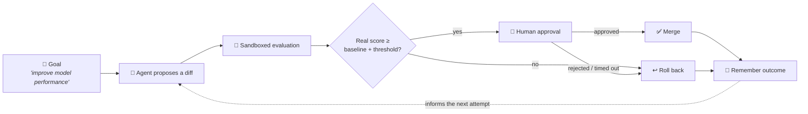
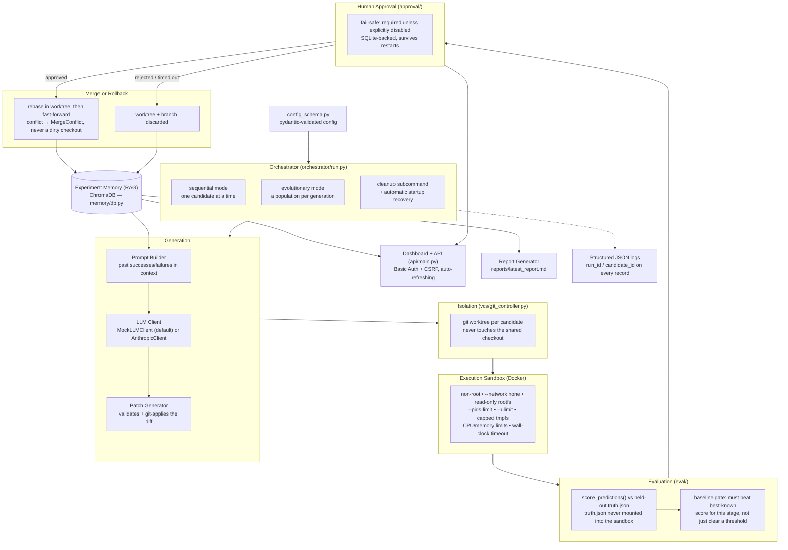
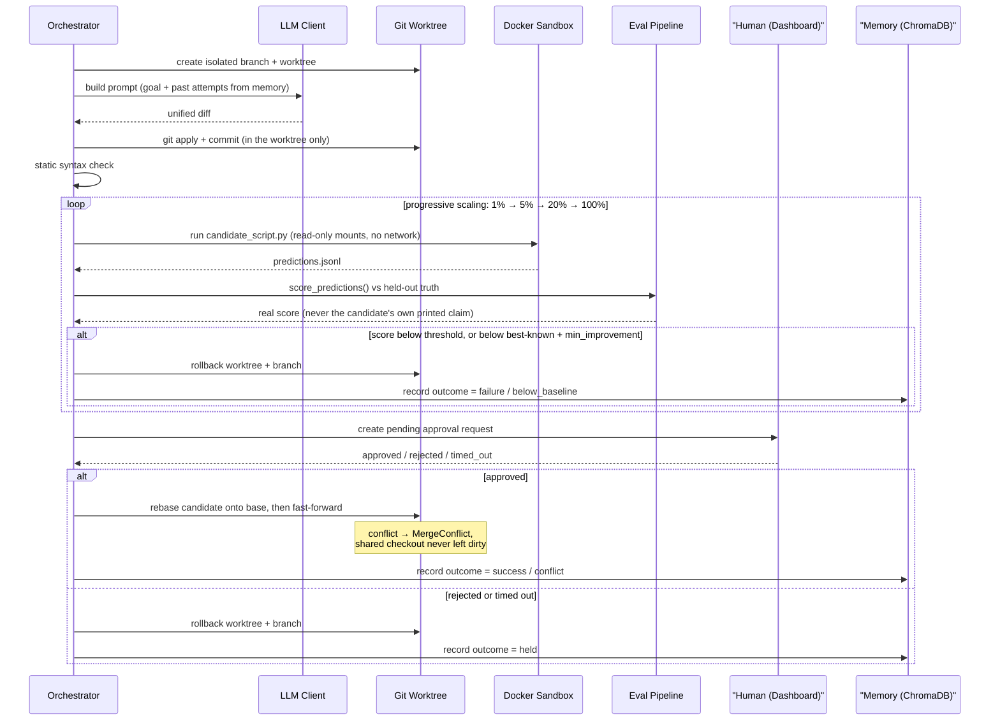
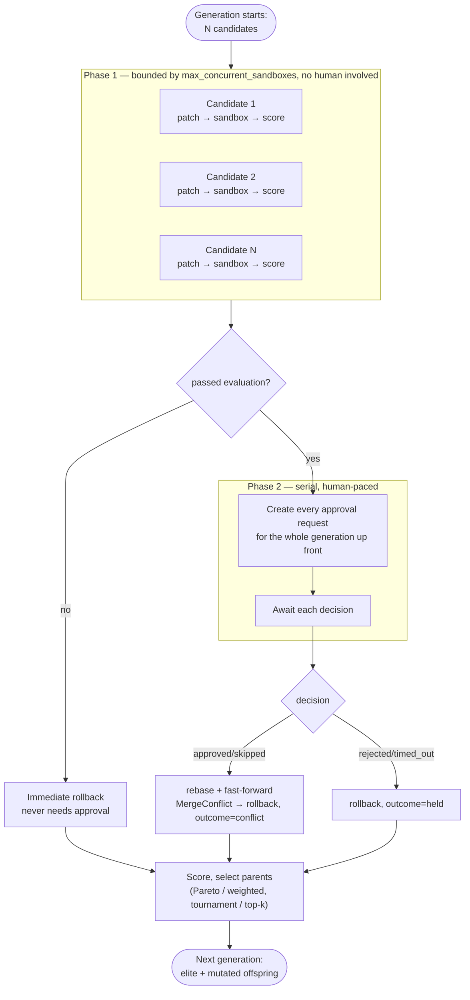
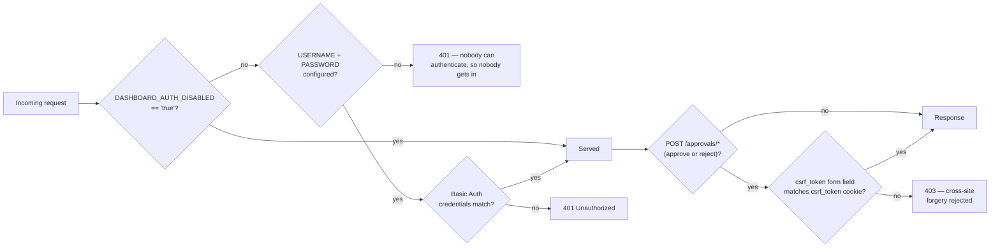

# Autoresearch Lite

[](https://github.com/suchitchopade3110-arch/autoresearch_lite/actions/workflows/tests.yml)
[](LICENSE)
[](pyproject.toml)

**An autonomous ML research agent.** It proposes a code change as a diff, applies it on its own isolated git branch, runs it inside a hardened Docker sandbox against progressively larger slices of a dataset, and merges or rolls it back based on a real, held-out score — gated by a human approval step, backed by RAG-style memory of past attempts, and resilient to crashes. It can run one candidate at a time, or evolve a whole population of them concurrently.



## Table of contents

- [Architecture](#architecture)
- [How a candidate's life cycle works](#how-a-candidates-life-cycle-works)
- [Evolutionary mode: two-phase scheduling](#evolutionary-mode-two-phase-scheduling)
- [Accuracy & performance](#accuracy--performance)
- [What's implemented](#whats-implemented)
- [What's NOT implemented yet](#whats-not-implemented-yet)
- [Security disclaimer](#security-disclaimer)
- [Dashboard security](#dashboard-security)
- [How to run locally](#how-to-run-locally)
- [Config schema](#config-schema-configsexampleyaml)
- [Repository layout](#repository-layout)
- [Running tests](#running-tests)
- [Remediation history](#remediation-history)
- [License](#license)

## Architecture



## How a candidate's life cycle works

Sequential mode runs exactly this, once per candidate:



## Evolutionary mode: two-phase scheduling

A whole population is evaluated per generation. Sandbox work is never blocked on a human — every candidate's evaluation finishes first, *then* every approval request is created together, so a reviewer sees the whole generation at once instead of candidates trickling in one at a time.



## Accuracy & performance

This is an *agent*, not a fixed model — there's no single "system accuracy." What's measurable is how the shipped default performs on the built-in demo task, and how reliable the harness itself is.

| What | Result |
|---|---|
| Default demo task (`configs/example.yaml`, `generation.client: mock`) | Binary classification on a synthetic noisy-linear-boundary dataset |
| `MockLLMClient`'s baseline solution, held-out test set | **98.0% accuracy** (245/250, seed 42) |
| Clears the config's progressive thresholds (0.5 → 0.6 → 0.7 → 0.8)? | Yes — merges on the first attempt with approval granted |
| Harness test suite | **139 tests passing**, including Docker-dependent sandbox/integration tests, on every push/PR via CI |
| Reward-hacking canary (`tests/test_reward_hacking.py`) | A candidate cannot buy a merge by printing a fake `SCORE:` claim — only a real prediction scored against never-mounted held-out labels counts |

**What this number does and doesn't mean:**
- It proves the *harness* works end-to-end (sandboxing, real scoring, approval gate, git isolation) — it is not a benchmark result to brag about.
- Swap in `generation.client: anthropic` (real `ANTHROPIC_API_KEY` required) and point it at your own dataset, and accuracy becomes whatever that model's generated code actually achieves — there is no fixed number for that case.
- Don't confuse "139 tests passing" (the harness's own code is correct) with "accuracy" (the demo task's classification performance) — they measure different things.

## What's implemented

- **Orchestrator (`orchestrator/run.py`):** two modes.
  - `--mode sequential` (default): one candidate at a time; loops up to `orchestrator.max_iterations`, stopping early once `target_score` is reached or `patience` iterations pass with no improvement.
  - `--mode evolutionary`: a population of candidates per generation, evaluated concurrently and evolved via `evolution/population.py`'s `EvolutionEngine` (selection, mutation-by-prompt, Pareto/weighted scoring, adaptive population sizing, all seeded for reproducibility via `evolution.random_seed`).
  - A `cleanup` subcommand (`python -m orchestrator.run cleanup --config ...`) reclaims state left behind by a run that crashed or was killed - orphaned candidate worktrees/branches and approval requests stuck pending past their deadline. It also runs automatically at the start of every `run` invocation, and `SIGINT`/`SIGTERM` exit cleanly instead of leaving a traceback.
- **Config validation (`config_schema.py`):** the config file is validated against a pydantic schema at load time - a malformed or missing `eval.stages` (which would otherwise let every candidate pass evaluation with a score of 0.0) is rejected up front with a readable error, not discovered deep inside a run.
- **Human-approval gate (`approval/`):** every candidate that passes evaluation is held pending a human decision before it merges - in either mode. The gate defaults to *required* even if the config is missing the `approval` section entirely or has a malformed value in it (see `approval/gate.py:resolve_approval_config`); only an explicit, valid `approval.enabled: false` disables it. A timeout with no decision is recorded as a real, persisted "timed_out" outcome and never merges - it is not treated as approval. In evolutionary mode, every candidate in a generation gets its approval request created up front (so a reviewer sees the whole generation together) before any of them are awaited, so a human is never a bottleneck on the sandbox pool. Decisions are stored in SQLite (`approvals.db`), so they survive a restart and are visible to both the orchestrator process and the dashboard process.
- **Dashboard + API (`api/main.py`):** a FastAPI app serving a small Tailwind-styled page (auto-refreshing, no separate frontend build) to review and approve/reject pending candidates, plus JSON endpoints (`/api/pending`, `/api/approvals`, `/api/history`, `/api/report`). It reads directly from the same ChromaDB store, approval database, and `evolution_report.jsonl` the orchestrator writes to - there's no separate/forked data store to drift out of sync. Protected by HTTP Basic Auth (fail-safe: required unless explicitly disabled) and a double-submit-cookie CSRF token on the approve/reject forms - see [Dashboard security](#dashboard-security) below.
- **Report generator (`reporting/report_generator.py`):** `compute_kpis()` is the single function both the dashboard and the end-of-run report (`reports/latest_report.md`, written automatically when a run finishes) call - so the two surfaces can't independently recompute the same numbers differently. Tracks merge rate, duplicate-avoidance rate, compute cost per improvement, and approval outcomes.
- **Git State Controller (`vcs/git_controller.py`):** every candidate gets its own `git worktree`, so branching, committing, merging, and rolling back a candidate never touches the caller's main checkout (or any uncommitted work in it) - and concurrent candidates in the evolutionary path never share a checkout with each other. A merge rebases the candidate onto the target branch inside its own worktree first, then fast-forwards - a conflict raises `MergeConflict` (recorded as a distinct `conflict` outcome) rather than ever leaving the shared checkout mid-merge. `target.repo_path`/`target.base_ref` let the repo under evolution be a separate checkout from this harness's own repository, and the controller survives a detached HEAD instead of crashing.
- **Crash recovery (`vcs/git_controller.py:cleanup_orphans`, `approval/store.py:timeout_stale_requests`):** a previous run that was killed mid-flight leaves candidate worktrees/branches and possibly a pending approval behind; both are reclaimed automatically at startup (or via the `cleanup` subcommand) rather than accumulating indefinitely.
- **Structured logging (`observability/logging_config.py`):** JSON logs to stdout, with `run_id` (and `candidate_id`, where applicable) bound to every record, so a run's log lines can be correlated and filtered without parsing free-text.
- **Execution Sandbox (`sandbox/executor.py`):** runs each candidate in Docker as a non-root user, with `--network none`, a read-only root filesystem, dropped capabilities, `--pids-limit` (fork-bomb protection), a per-process open-file-descriptor `--ulimit`, a size-capped `/tmp` tmpfs, and the existing CPU/memory limits and wall-clock timeout. Bind-mounted files/directories are explicitly `chmod`'d before mounting, so the sandbox's non-root UID can always read/write them regardless of the host's own permission bits.
- **Real evaluation pipeline (`eval/dataset.py`, `eval/pipeline.py`):** a deterministic synthetic dataset (a noisy linear boundary), split into `train.jsonl`/`test.jsonl` (both mounted read-only into the sandbox) and `truth.json` (the held-out labels - stays on the host, never mounted). A candidate reads `TRAIN_PATH`/`TEST_PATH`/`SUBSET_PERCENTAGE`, and writes real predictions to `/app/out/predictions.jsonl`, which `EvalPipeline.score_predictions()` scores against `truth.json`. A printed `SCORE:` line is parsed only as a diagnostic to flag a mismatch between what the candidate claims and its real score - it is never trusted for gating, so a candidate cannot buy a merge by printing a perfect score claim (see `tests/test_reward_hacking.py`). A merge also requires beating the best-known score for that stage by `eval.min_improvement` (`eval/baseline.py`), not just clearing the stage's absolute threshold.
- **Experiment Memory (RAG) (`memory/db.py`):** a local ChromaDB instance storing hypotheses, diffs, outcomes, metrics, and rationale per experiment (cosine distance, so `evolution/duplicate_checker.py`'s similarity threshold is meaningful). An exact-diff repeat is caught via a cheap metadata lookup (`has_exact_diff`) before paying for an embedding + nearest-neighbor search.
- **Failure Analysis (`memory/failure_analysis.py`):** categorizes failures (syntax, runtime, timeout, resource-limit, metric-regression).
- **Prompt Builder (`generation/prompt_builder.py`):** retrieves past successes/failures from memory into the next prompt.
- **Patch Generation (`generation/patch_generator.py`):** validates and applies unified diffs against `LLMClient.generate_diff(prompt, target_file, current_content)` - every call includes the target file's real current content, so a real model writes a diff against what's actually there rather than a stale assumption. Two implementations: `MockLLMClient` (default, no network/key needed - always implements the same honest baseline solution) and `AnthropicClient` (`generation.client: anthropic` in config; reads `ANTHROPIC_API_KEY` from the environment, never from config). `AnthropicClient` retries up to 3 times on a `git apply --check` failure, feeding the actual stderr back into the next prompt, and records `input_tokens`/`output_tokens`/`estimated_cost_usd` into every candidate's metrics and the end-of-run report.
- **Static Analysis Pre-check (`generation/static_check.py`):** rejects malformed/invalid syntax before sandbox execution.
- **Multi-objective scoring (`evolution/scoring.py`):** a candidate's real evaluation score drives selection, and a failed candidate can never outrank a successful one under either scoring strategy regardless of how fast it failed.

## What's NOT implemented yet

- **`MockLLMClient` always returns the same diff regardless of prompt/history.** This is deliberate - it's the zero-setup default with no network or API key needed, not a bug. Set `generation.client: anthropic` for a real, context-aware model.
- **Carbon-footprint methodology.** `energy_estimate` is `execution_time * energy_watts_constant` (an arbitrary multiplier, default 10.0), not a real methodology like CodeCarbon or a grid-intensity constant - it's a placeholder signal for relative comparison between candidates, not an absolute measurement.

## Security disclaimer

The sandbox runs candidates as a non-root user, with `--network none`, a read-only root filesystem, dropped capabilities, a `--pids-limit`, a per-process file-descriptor `--ulimit`, a size-capped `/tmp` tmpfs, and standard Docker `--cpus`/`--memory` limits plus a wall-clock timeout via `subprocess`. This meaningfully raises the bar against a candidate trying to exfiltrate data, persist state, exhaust the host's process table, or exceed its resource limits. **It still does NOT provide hardened security against zero-days, container escapes, or a deliberately adversarial kernel exploit.** Do not execute untrusted malware in this sandbox.

## Dashboard security

The dashboard is fail-safe like the approval gate: **authentication is required unless explicitly disabled.**



- Set `DASHBOARD_USERNAME` and `DASHBOARD_PASSWORD` in the environment to enable HTTP Basic Auth on every route (the page and every `/api/*` endpoint).
- If neither is set and auth hasn't been explicitly disabled, every request is rejected (401) - there's no way to authenticate, so nobody gets in. This is deliberate: an unauthenticated dashboard that can approve merges into your codebase should never be reachable by default.
- For local/single-user use where this is unnecessary, set `DASHBOARD_AUTH_DISABLED=true` explicitly.
- The approve/reject forms carry a CSRF token (double-submit cookie pattern) - a POST without a matching token is rejected (403), regardless of auth, so a cross-site auto-submitting form can't trigger an approval using a browser's cached credentials.

## How to run locally

### Prerequisites

- Docker must be installed and running.
- Python 3.9+
- `pip install -r requirements.txt`

### 1. Start the dashboard (in its own terminal)

```bash
# Local/single-user use:
DASHBOARD_AUTH_DISABLED=true uvicorn api.main:app --reload

# Or, to require a login:
DASHBOARD_USERNAME=admin DASHBOARD_PASSWORD=change-me uvicorn api.main:app --reload
```

Open `http://localhost:8000` to see pending approvals and run history. Leave this running - the orchestrator will block waiting for decisions made here.

### 2. Run the orchestrator (sequential mode)

```bash
python -m orchestrator.run --config configs/example.yaml --goal "Improve model performance"
# optional: --max-iterations 10 --target-score 0.9 --patience 3
```

Each candidate that passes evaluation shows up on the dashboard; approve or reject it there. No decision within `approval.timeout_seconds` (default 30 minutes) holds it - it will not merge.

### Evolutionary mode

```bash
python -m orchestrator.run --config configs/example.yaml --goal "Improve model performance" --mode evolutionary
```

Every candidate that passes evaluation in every generation gets its own pending approval, resolved independently and concurrently. Writes `evolution_report.jsonl` (one line per generation), stores every candidate's outcome in ChromaDB (`chroma_db/`), and writes `reports/latest_report.md` when the run finishes.

### Recovering from a crash

```bash
python -m orchestrator.run cleanup --config configs/example.yaml
```

Removes any candidate worktrees/branches left behind by a run that was killed or crashed, and times out any approval request that's been pending past its deadline with nobody left to resolve it. Runs automatically at the start of every `run` invocation too, so this is mainly useful to run standalone after a crash without immediately starting a new run.

### Running without a human present (e.g. CI, demos)

Set `approval.enabled: false` explicitly in your config. This is an intentional, visible override, not a silent default - the shipped `configs/example.yaml` defaults to `enabled: true` and requires a human decision.

### Separating the harness from the code under evolution

By default, `target.repo_path` is `.` - candidates are generated directly into this harness's own repository. To evolve a separate codebase instead (recommended for anything beyond local experimentation), point `target.repo_path` at that repository's checkout; the orchestrator warns at startup if it resolves back to the harness's own directory.

### Swapping in a real LLM

Set `generation.client: anthropic` in your config and export `ANTHROPIC_API_KEY` - see `generation/patch_generator.py:AnthropicClient`. To use a different provider, implement the `LLMClient` interface:

```python
class MyRealLLMClient(LLMClient):
    def generate_diff(self, prompt: str, target_file: str, current_content: str) -> str:
        # Call your API here and return the string unified diff
        return api.call(prompt, current_content)
```

## Config schema (`configs/example.yaml`)

```yaml
# Repo under evolution - defaults to "." (this harness's own repo).
target:
  repo_path: "."
  # base_ref: main            # pin a base commit/branch explicitly

sandbox:
  timeout_seconds: 5
  cpu_limit: "0.5"
  memory_limit: "256m"
  pids_limit: 128             # fork-bomb protection
  ulimit_nofile: 1024         # per-process open file descriptors
  tmpfs_size_mb: 64           # /tmp is RAM-backed - cap its size

dataset:
  path: "dummy_data"  # directory - train.jsonl/test.jsonl/truth.json generated once if missing
  size: 1000
  seed: 42
  test_frac: 0.25

eval:
  stages:                          # progressive scaling - must be non-empty
    - subset_percentage: 1
      threshold: 0.5
    - subset_percentage: 5
      threshold: 0.6
    - subset_percentage: 20
      threshold: 0.7
    - subset_percentage: 100
      threshold: 0.8
  min_improvement: 0.001           # a merge must also beat the best-known score for its final stage by this much
  state_path: "state.json"         # persisted best-known score per stage

orchestrator:                      # sequential mode only
  max_iterations: 1
  target_score: 1.0
  patience: 1

evolution:                         # evolutionary mode only
  population_size: 5
  max_generations: 3
  max_concurrent_sandboxes: 3
  duplicate_threshold: 0.25
  selection_strategy: tournament
  scoring_strategy: pareto
  random_seed: 42

generation:
  max_retrieved_failures: 2
  max_retrieved_successes: 2
  prompt_char_budget: 4000
  client: mock                      # or "anthropic" - needs ANTHROPIC_API_KEY in the environment
  # model: claude-sonnet-5          # anthropic only, defaults to claude-sonnet-5

approval:                          # both modes
  enabled: true                    # missing/malformed config also defaults to true
  timeout_seconds: 1800
  poll_interval_seconds: 5
  db_path: "approvals.db"
```

## Repository layout

```
autoresearch_lite/
├── orchestrator/       # run.py: the main loop, both modes, cleanup subcommand
├── generation/         # prompt building, LLM clients, patch validation
├── evolution/          # population engine, two-phase scheduler, scoring, duplicate checking
├── eval/               # dataset generation, progressive-scaling evaluation, baseline gate
├── sandbox/            # Docker executor + Dockerfile (hardened, non-root)
├── vcs/                # git worktree isolation, rebase-then-ff-only merge, crash recovery
├── approval/           # SQLite-backed human-approval gate, fail-safe config resolution
├── memory/             # ChromaDB-backed RAG memory + failure analysis
├── reporting/          # shared KPI computation for the dashboard and end-of-run reports
├── observability/      # structured JSON logging
├── api/                # FastAPI dashboard (Basic Auth + CSRF) and JSON endpoints
├── config_schema.py    # pydantic validation of config.yaml at load time
├── configs/example.yaml
├── tests/              # 139 tests - pure-Python + Docker-dependent
├── .github/workflows/  # CI: full suite on every push/PR
├── REMEDIATION.md       # every fixed gap mapped to its commit and proving test
└── pyproject.toml / LICENSE
```

## Running tests

```bash
pytest
```

Most test files are pure Python and need no Docker. `test_sandbox.py` and `test_integration*.py` build and run the Docker sandbox image and require Docker to be running (two exceptions - `test_docker_run_command_includes_resource_hardening_flags` and `test_run_candidate_widens_permissions_before_mounting` - mock `subprocess.run` and need no daemon). CI (`.github/workflows/tests.yml`) runs the full suite, including these, on every push and pull request against `main`.

## Remediation history

This codebase went through a structured, test-driven remediation: an initial audit found 22 gaps across correctness, resilience, security, and hygiene, closed across four waves (reward-hacking integrity → real agent behavior → resilience/crash-recovery → packaging/security hygiene). Every gap is mapped to the commit that closed it and the test that proves it in [`REMEDIATION.md`](REMEDIATION.md).

## License

MIT - see [LICENSE](LICENSE).
